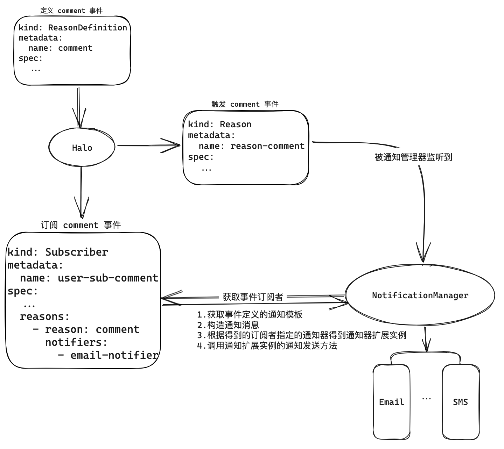
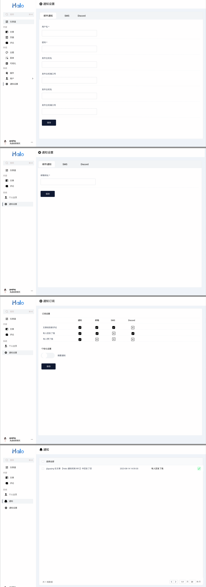

## Background

In Halo, there are user collaboration scenarios — for example, when a user publishes a post, a visitor comments on it, and the visitor wants to be notified when the author replies. Without a notification system, the following scenarios are not possible:

1. Visitors can only manually revisit the commented post after some time to check for replies.
2. User registration cannot verify email addresses, making malicious registration easier.

To address these needs — allowing users to receive notifications or verification messages and manage them — we need to design a notification system that pushes and manages notifications based on user subscriptions and preferences.

## Requirements

- Visitors want to receive notifications when their comment is replied to; authors want notifications when someone comments on their post.
- User registration should verify the email address so that one email can only register one account, preventing mailbox squatting and reducing malicious registrations.
- For the app marketplace plugin, administrators want to receive new order notifications.
- For the paid subscription plugin, paying subscribers should receive links to paid articles.

## Goals

Design a notification system that meets the following:

- Supports multiple notification channels (email, SMS, Slack, etc.).
- Supports extensible notification conditions — e.g., Halo has a new post event; if a user subscribes to new posts but a paid subscription plugin restricts access, only eligible users should receive the notification based on configurable conditions.
- Supports customization (enable/disable notifications, notification windows, etc.).
- Supports full notification lifecycle (send, receive, view, mark, etc.).
- Multi-language notification content.
- Extensible event types — plugins may define their own events (e.g., the app marketplace plugin).

## Non-Goals

- Halo will only implement in-site notifications and email notifications. Other channels must be provided by plugins.
- Scheduled notifications, notification frequency, or digest notifications are non-essential and can be handled by plugins.
- Multi-language support: only Chinese and English for now.
- Custom notification templates: default templates are provided by event definers. Customization can be achieved through specific notifier implementations.

## Design

### Notification Data Model

#### Notification Event Categories and Events

Define event categories (`ReasonType`) and their instances (`Reason`) to declare what data a notification event carries and which template to use.

`ReasonType` is a custom model for defining event categories:

```yaml
apiVersion: notification.halo.run/v1alpha1
kind: ReasonType
metadata:
  name: comment
spec:
  displayName: "Comment Received"
  description: "The user has received a comment on an post."
  properties:
    - name: postName
      type: string
      description: "The name of the post."
      optional: false
    - name: postTitle
      type: string
      optional: true
    - name: commenter
      type: string
      description: "The email address of the user who has left the comment."
      optional: false
    - name: comment
      type: string
      description: "The content of the comment."
      optional: false
```

`Reason` is a custom model for a specific notification reason, an instance of `ReasonType`. When an event fires, create a `Reason` resource:

```yaml
apiVersion: notification.halo.run/v1alpha1
kind: Reason
metadata:
  name: comment-axgu
spec:
  reasonType: comment
  author: 'guqing'
  subject:
    apiVersion: 'content.halo.run/v1alpha1'
    kind: Post
    name: 'post-axgu'
    title: 'Hello World'
    url: 'https://guqing.xyz/archives/1'
  attributes:
    postName: "post-fadp"
    commenter: "guqing"
    comment: "Hello! This is your first notification."
```

#### Subscription

The `Subscription` custom model defines the relationship between an event and the subscriber to be notified. `subscriber` is the subscribing user, `unsubscribeToken` is the auth token for unsubscribing, and `reason` is the event the subscriber is interested in:

```yaml
apiVersion: notification.halo.run/v1alpha1
kind: Subscription
metadata:
  name: user-a-sub
spec:
  subscriber:
    name: guqing
  unsubscribeToken: xxxxxxxxxxxx
  reason:
    reasonType: new-comment-on-post
    subject:
      apiVersion: content.halo.run/v1alpha1
      kind: Post
      name: 'post-axgu'
    # expression: 'props.owner == "guqing"'
```

- `spec.reason.subject`: Matches events by subject. If name is omitted, matches all events with the same kind and apiVersion.
- `spec.expression`: SpEL expression for advanced matching, e.g., `props.owner == "guqing"`. See: [Enhanced Subscription model with expression matching](https://github.com/halo-dev/halo/issues/5632)

> When both `spec.expression` and `spec.reason.subject` are present, `spec.reason.subject` takes precedence. Using both simultaneously is not recommended.

Unsubscribe API: `GET /apis/api.notification.halo.run/v1alpha1/subscriptions/{name}/unsubscribe?token={unsubscribeToken}`

#### User Notification Preferences

Stored in the user preferences ConfigMap under a `notification` key, mapping event types to notification channels:

```yaml
apiVersion: v1alpha1
kind: ConfigMap
metadata:
  name: user-preferences-guqing
data:
  notification: |
    {
      reasonTypeNotification: {
        'new-comment-on-post': {
          enabled: true,
          notifiers: [
            email-notifier,
            sms-notifier
          ]
        },
        new-post: {
          enabled: true,
          notifiers: [
            email-notifier,
            webhook-router-notifier
          ]
        }
      },
    }
```

#### In-Site Notification

When a user subscribes to an event and it fires, a `Notification` resource is created. This is independent of the notification channel (notifier). The `recipient` is the username. It appears in the user's notification center:

```yaml
apiVersion: notification.halo.run/v1alpha1
kind: Notification
metadata:
  name: notification-abc
spec:
  recipient: "guqing"
  reason: 'comment-axgu'
  title: 'notification-title'
  rawContent: 'notification-raw-body'
  htmlContent: 'notification-html'
  unread: true
  lastReadAt: '2023-08-04T17:01:45Z'
```

Notification center APIs:

1. List user notifications: `GET /apis/api.notification.halo.run/v1alpha1/userspaces/{username}/notifications`
2. Mark all as read: `PUT /apis/api.notification.halo.run/v1alpha1/userspaces/{username}/notifications/mark-as-read`
3. Mark specific as read: `PUT /apis/api.notification.halo.run/v1alpha1/userspaces/{username}/notifications/mark-specified-as-read`

#### Notification Templates

`NotificationTemplate` custom model defines templates for events. It uses `reasonSelector` to reference an event category. When an event fires, the best template is selected based on the user's language preference:

1. Match by language specificity (e.g., `gl_ES` > `gl`).
2. If multiple templates match, the one with the most recent `metadata.creationTimestamp` is used.

Template syntax uses Thymeleaf Engine. Plain text templates use `textual` mode: [Thymeleaf textual syntax](https://www.thymeleaf.org/doc/tutorials/3.1/usingthymeleaf.html#textual-syntax). HTML templates use standard expression syntax: [standard expression syntax](https://www.thymeleaf.org/doc/tutorials/3.1/usingthymeleaf.html#standard-expression-syntax).

Extra attributes available in notification context:

- `site.title`
- `site.subtitle`
- `site.logo`
- `site.url`
- `subscriber.id`: username for registered users, `annoymousUser#email` for anonymous users
- `subscriber.displayName`: email or `@username`
- `unsubscribeUrl`

Event definers should avoid using these reserved attribute names.

```yaml
apiVersion: notification.halo.run/v1alpha1
kind: NotificationTemplate
metadata:
  name: template-new-comment-on-post
spec:
  reasonSelector:
    reasonType: new-comment-on-post
    language: zh_CN
  template:
    title: "Your article [(${postTitle})] received a new comment"
    body: |
      [(${commenter})] commented on your article [(${postTitle})]:
      [(${comment})]
```

#### Notifier Declaration and Extension

`NotifierDescriptor` describes a notifier — its name, description, and associated `ExtensionDefinition` — so users know what it does and the NotificationCenter knows how to load and configure it:

```yaml
apiVersion: notification.halo.run/v1alpha1
kind: NotifierDescriptor
metadata:
  name: email-notifier
spec:
  displayName: 'Email Notifier'
  description: 'Sends notifications via email.'
  notifierExtName: 'Extension name for the notifier'
  senderSettingRef:
    name: 'email-notifier'
    group: 'sender'
  receiverSettingRef:
    name: 'email-notifier'
    group: 'receiver'
```

APIs for configuring notifiers:

Admin APIs:
1. Get sender config: `GET /apis/api.console.halo.run/v1alpha1/notifiers/{name}/sender-config`
2. Save sender config: `POST /apis/api.console.halo.run/v1alpha1/notifiers/{name}/sender-config`

User center APIs:
1. Get receiver config: `GET /apis/api.notification.halo.run/v1alpha1/notifiers/{name}/receiver-config`
2. Save receiver config: `POST /apis/api.notification.halo.run/v1alpha1/notifiers/{name}/receiver-config`

Notifier extension point:

```java
public interface ReactiveNotifier extends ExtensionPoint {

  Mono<Void> notify(NotificationContext context);
}

@Data
public class NotificationContext {
  private Message message;
  private ObjectNode receiverConfig;
  private ObjectNode senderConfig;

  @Data
  static class Message {
    private MessagePayload payload;
    private Subject subject;
    private String recipient;
    private Instant timestamp;
  }

  @Data
  public static class Subject {
    private String apiVersion;
    private String kind;
    private String name;
    private String title;
    private String url;
  }

  @Data
  static class MessagePayload {
    private String title;
    private String rawBody;
    private String htmlBody;
    private ReasonAttributes attributes;
  }
}
```

Notification data structure interaction:



Notification UI design:



### Notification Module Features

- Send: When a notification event fires, the system automatically sends notifications based on subscriber preferences.
- Receive: Users can choose notification channels (email, SMS, custom routes, etc.).
- View: Users can view all notifications (read and unread) in Halo.
- Mark: Users can mark notifications as read or unread.

### Notification List Filtering

- By event type (e.g., new post, new comment, status update)
- By read status (read/unread)
- By keyword (search within notification content)
- By time range (e.g., last week, last month)

### Customization Options

Future possibilities if demand arises:

- Notification time windows (e.g., only during work hours)
- Notification frequency (daily, weekly, monthly digests)
- Digest notifications (weekly summary)

## Conclusion

Through the above design and implementation, we have created a notification system that automatically filters and pushes notifications based on user preferences. The system is highly extensible to support more event types, notification channels, and filtering strategies.
